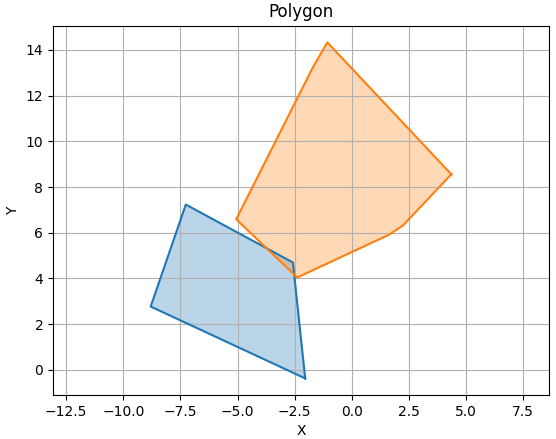

### Build

```
mkdir build
cd build
cmake ..
make
```

------

### Run

The polygon is generated by the gaussian.

```
cd build
./charlie -5 5 -2 8 
```
The result is 0, which represents no overlapping. The result is 1, which represents overlapping.

------

### View
```
cd build
python3 gjk/view/visualization.py
```

